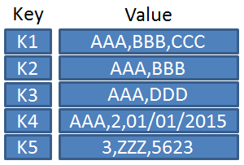

# Cluster architecture

A Kubernetes cluster is a set of nodes that host applications in form of containers.  
The nodes are separated in master and worker nodes.

* Master nodes  
    Host control plane components to manage, plan, schedule, monitor nodes
    * [Control plane components](https://kubernetes.io/docs/concepts/overview/components/)
        * etcd : Consistent and highly-available key value store used as Kubernetes' backing store for all cluster data
        * kube-apiserver : Component of the Kubernetes control plane that exposes the Kubernetes API - Front end for the control plane
        * kube-scheduler : Identifies the right node to place a container based on requirements (policies, taints, ressources, etc.)
        * kube-controller-manager : Control plane component that runs controller processes
            * Node controller : Responsible for noticing and responding when nodes go down
            * Job controller : Watches for Job objects that represent one-off tasks, then creates Pods to run those tasks to completion
            * Endpoints controller : Populates the Endpoints object (that is, joins Services & Pods)
            * Service Account & Token controllers : Create default accounts and API access tokens for new namespaces
        * Container runtime : The container runtime is the software that is responsible for running containers
  

* Worker nodes  
    Host applications as containers
    * kubelet : An agent that runs on each node in the cluster - It makes sure that containers are running in a Pod
    * kube-proxy : Network proxy maintaining network rules - Allow network communication to Pods from in- or outside of clusters
    * Container runtime : The container runtime is the software that is responsible for running containers

## ETCD

### What is etcd

etcd is a consistent and highly-available key value store used as Kubernetes' backing store for all cluster data.  
A distributed reliable key-value store that is simple, secure and fast.

&rarr; https://etcd.io/docs/

### What is a key-value store

A key–value database, or key–value store, is a data storage paradigm designed for storing, retrieving, and managing associative arrays, and a data structure. This specific type of NoSQL database uses the key-value method and represents a collection of numerous key-value pairs. The keys are unique identifiers for the values. The values can be any type of object.

© [wikipedia](https://de.wikipedia.org/wiki/Schl%C3%BCssel-Werte-Datenbank#/media/Datei:KeyValue.PNG)

### How to get started quickly

* Download binaries
* Extract
* Run etcd service

&rarr; https://etcd.io/docs/v3.5/quickstart/

### How to control etcd

etcdctl is the CLI tool used to interact with etcd server.  
Use etcdctl to control etcd and set a key

`etcdctl put greeting "Hello, etcd"`

... and retrieve the key

`etcdctl get greeting`

&rarr; https://manpages.org/etcdctl

### etcd in Kubernetes

The etcd data stores information regarding the Kubernetes cluster such as:

* nodes
* pods
* configs
* secrets
* accounts
* roles
* bindings
* etc.

Every information you see, when you run the `kubectl get` command, comes from the etcd server, also every change made to the Kubernetes cluster is updated or created in the etcd server. The kube-apiserver will look into the option `--advertise-client-urls` to find the IP address and port of the etcd server.

## kube-apiserver

